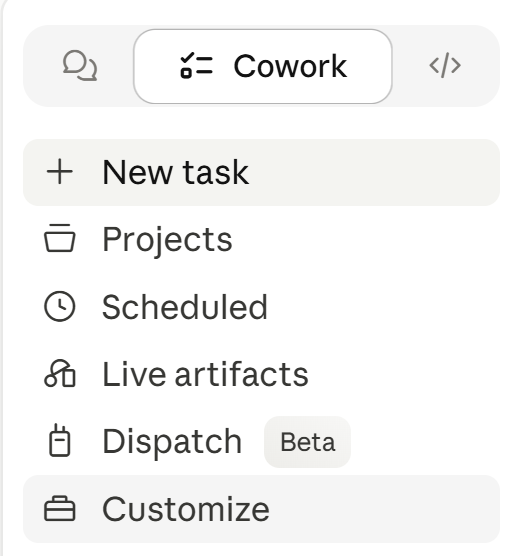
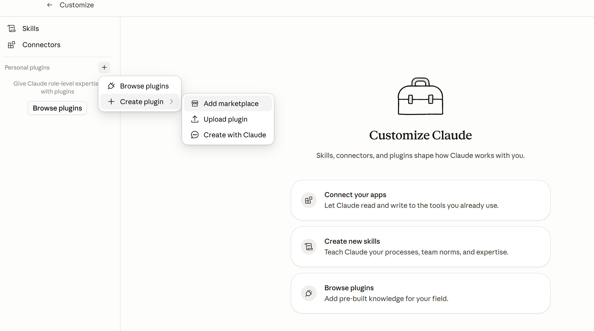
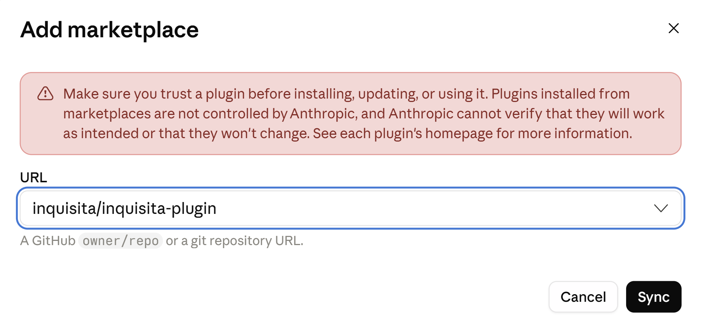
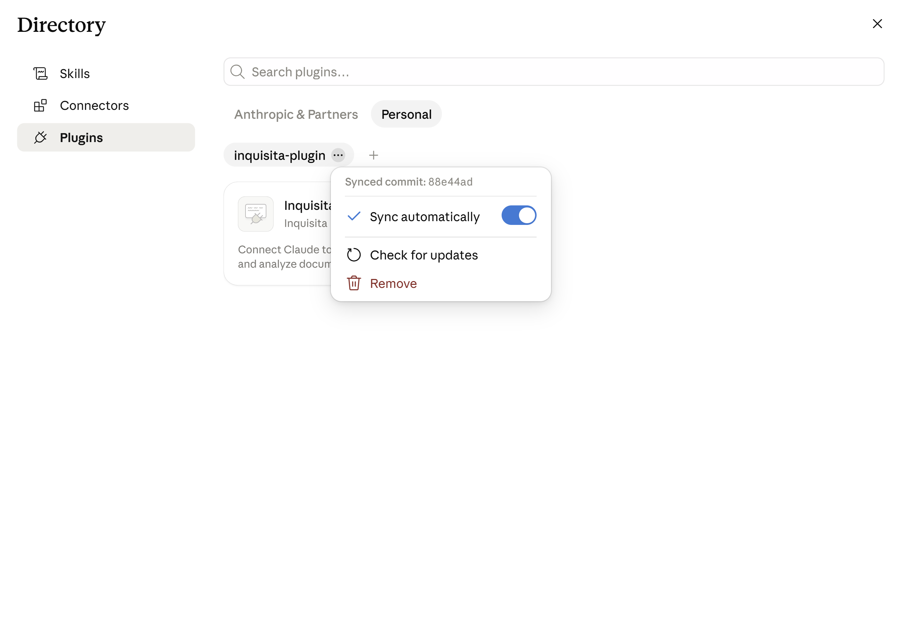
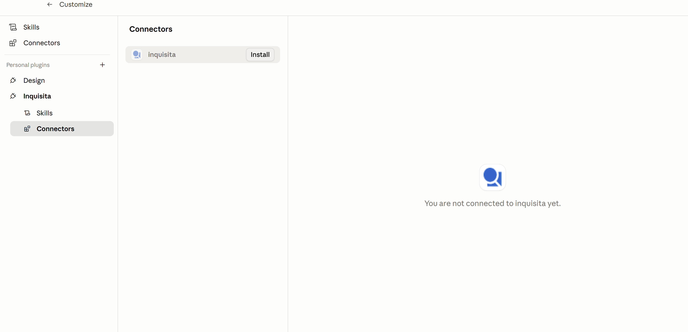

## Inquisita plugin for Claude

The official [Inquisita](https://inquisita.ai) plugin for Claude — a document intelligence platform for legal, regulatory, and compliance workflows. Upload, process, search, and analyze multimodal documents from inside Claude, with structured results that persist as shared organizational knowledge.

## Install in Claude Cowork (recommended)

### 1. Open Cowork → Customize

In Claude Desktop, switch to the **Cowork** tab and open **Customize**.



### 2. Add a marketplace

Under **Personal plugins**, click **+** → **Create plugin** → **Add marketplace**.



### 3. Paste the Inquisita marketplace URL

Enter `inquisita/inquisita-plugin` and click **Sync**.



### 4. Confirm the plugin synced

The `inquisita-plugin` marketplace appears under **Personal**, and the Inquisita plugin is listed. The dropdown should show "Sync automatically" enabled so you receive updates.



### 5. Install the Inquisita connector

Open the **Inquisita** plugin's **Connectors** tab and click **Install**. Sign in when prompted — Claude is now connected to Inquisita.



> Installing the plugin alone does not connect the MCP. The connector must be installed from the plugin's settings as a second step — that's what registers Inquisita under **Connectors** and triggers sign-in.

## Install in Claude Code (CLI)

Add the marketplace, then install the plugin:

```bash
/plugin marketplace add inquisita/inquisita-plugin
/plugin install inquisita@inquisita
```

The bundled MCP server (`https://mcp.inquisita.ai/mcp`) auto-registers — run `/mcp` to authenticate on first use.

## What's included

| Component | Purpose |
|---|---|
| **MCP server** | Hosted Inquisita API (`mcp.inquisita.ai`) — matters, documents, collections, analysis jobs |
| **Skill: `inquisita`** | Teaches Claude how to organize documents, run analysis, and build collections in Inquisita |

More skills will be added over time for focused workflows (research, extraction, large-document analysis).

## License

Proprietary — free for Inquisita customers to use. See [LICENSE](./LICENSE) for terms.

## Learn more

Visit [inquisita.ai](https://inquisita.ai).
